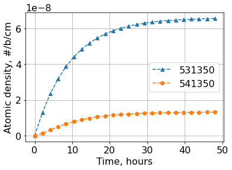
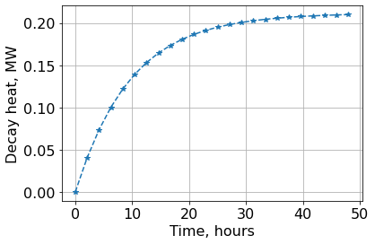
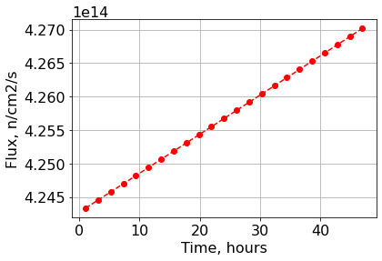

.. _xenon_example:

Custom Xenon and Samarium Chains
================================

Description
-----------

Example on how to execute a full depletion calculations.

Load modules
------------

.. code::  

    import numpy as np
    from pyIsoDep.functions.maindepletionsolver import MainDepletion
    from pyIsoDep.functions.generatedata import TransmutationData
    from pyIsoDep.functions.postprocessresults import Results

Define xenon- and samarium- data
~~~~~~~~~~~~~~~~~~~~~~~~~~~~~~~~

.. code::  

    ID = [531350, 541350, 611490, 621490, 922350, 922380]
    sig_c = [6.8, 250537.62, 132.47, 6968.75, 5.0, 8.0]
    sig_f = [0.0, 0.0000000, 0.000, 0.00000, 97., 3.8]
    kappa = [0.0, 0.0000000, 0.000, 0.00000, 202.44, 202.44]
    N0 = [0.0, 0.0000000, 0.000, 0.00000, 6.43230E-04, 2.58062E-03]
    
    #    531350, 541350, 611490, 621490, 922350, 922380
    mtxFY = [
        [0.0000, 0.0000, 0.0000, 0.0000, 0.06306, 0.06306],  # 531350
        [0.0000, 0.0000, 0.0000, 0.0000, 0.00248, 0.00248],  # 541350
        [0.0000, 0.0000, 0.0000, 0.0000, 0.01100, 0.01100],  # 611490
        [0.0000, 0.0000, 0.0000, 0.0000, 0.00000, 0],  # 621490
        [0.0000, 0.0000, 0.0000, 0.0000, 0.00000, 0],  # 922350
        [0.0000, 0.0000, 0.0000, 0.0000, 0.00000, 0],  # 922380
        ]

Data Generation Stage
~~~~~~~~~~~~~~~~~~~~~

.. code::  

    # Reset the data container
    data = TransmutationData(libraryFlag=True, wgtFY=1.0)
    # Feed cross sections into the container
    data.ReadData(ID, sig_f=sig_f, sig_c=sig_c, fymtx=mtxFY, EfissMeV=kappa)
    # Condense the data only to specific set of isotopes
    data.Condense(ID)

Depletion Stage
~~~~~~~~~~~~~~~

Define metadata
^^^^^^^^^^^^^^^

.. code::  

    volume = 332097.750  # volume in cm**3
    
    timepoints = np.linspace(0, 48.0, 24)
    power = 330000000.*np.ones(len(timepoints)-1)  # Watts

Execute Depletion
^^^^^^^^^^^^^^^^^

.. code::  

    dep = MainDepletion(0.0, data)
    dep.SetDepScenario(power=power, timeUnits="hours", timepoints=timepoints)
    # set initial composition
    dep.SetInitialComposition(ID, N0, vol=volume)
    # solve the Bateman equations
    dep.SolveDepletion(method="cram")

Post depletion analysis
^^^^^^^^^^^^^^^^^^^^^^^

.. code::  

    dep.DecayHeat()
    dep.Radiotoxicity()
    dep.Activity()
    dep.Mass()

Post-process results
~~~~~~~~~~~~~~~~~~~~

.. code::  

    res = Results(dep)

.. code::  

    res.getvalues("totalQt")

.. parsed-literal::

    array([7.88631353e-03, 4.04865200e+04, 7.35204570e+04, 1.00254333e+05,
           1.21809725e+05, 1.39162193e+05, 1.53123558e+05, 1.64356367e+05,
           1.73396521e+05, 1.80675661e+05, 1.86540769e+05, 1.91270501e+05,
           1.95088552e+05, 1.98174453e+05, 2.00672284e+05, 2.02697667e+05,
           2.04343391e+05, 2.05683922e+05, 2.06779022e+05, 2.07676657e+05,
           2.08415329e+05, 2.09025941e+05, 2.09533304e+05, 2.09957339e+05])

.. code::  

    res.plot("Nt", timeUnits="hours", markers=['--^', '--o'], isotopes=[531350, 541350],
             ylabel="Atomic density, #/b/cm")

.. code::  

    res.plot("totalQt", timeUnits="hours", norm=1E+6, ylabel="Decay heat, MW")

.. code::  

    res.plot("flux", timeUnits="hours", markers="--ro", ylabel="Flux, n/cm2/s")

