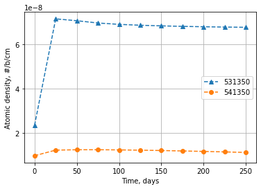
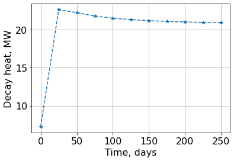
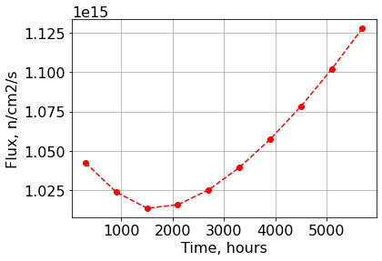

.. _fulldep_example:

Full Depletion Case
===================

Description
-----------

Example on how to execute a full depletion calculations.

Load modules
------------

.. code:: 

    import numpy as np
    from pyIsoDep.functions.maindepletionsolver import MainDepletion
    from pyIsoDep.functions.generatedata import TransmutationData
    from pyIsoDep.functions.postprocessresults import Results

Cross sections pre-generated in advance
~~~~~~~~~~~~~~~~~~~~~~~~~~~~~~~~~~~~~~~

.. code:: 

    from pyIsoDep.tests.pregenerated_xs import ID, N0, sig_c,\
        sig_c2m, sig_n2n, sig_n3n, sig_f

Data Generation Stage
~~~~~~~~~~~~~~~~~~~~~

.. code:: 

    # Reset the data container
    data = TransmutationData(libraryFlag=True, wgtFY=1.0)
    # Feed cross sections into the container
    data.ReadData(ID, sig_f=sig_f, sig_c=sig_c, sig_c2m=sig_c2m,
                  sig_n2n=sig_n2n, sig_n3n=sig_n3n, flagBarns=False)

Depletion Stage
~~~~~~~~~~~~~~~

Define metadata
^^^^^^^^^^^^^^^

.. code:: 

    nsteps = 10
    timeDays = 25*np.ones(nsteps)
    power = 348E+6*np.ones(nsteps)
    volume = 332097.750  # volume in cm**3

Execute Depletion
^^^^^^^^^^^^^^^^^

.. code:: 

    dep = MainDepletion(0.0, data)
    # define metadata (steps, flux, and so on)
    dep.SetDepScenario(power=power, timeUnits="days", timesteps=timeDays)
    # set initial composition
    dep.SetInitialComposition(ID, N0, vol=volume)
    # solve the Bateman equations
    dep.SolveDepletion(method="cram")

Post depletion analysis
^^^^^^^^^^^^^^^^^^^^^^^

.. code:: 

    dep.DecayHeat()
    dep.Radiotoxicity()
    dep.Activity()
    dep.Mass()

Post-process results
~~~~~~~~~~~~~~~~~~~~

.. code:: 

    res = Results(dep)

.. code:: 

    res.getvalues("totalQt")

.. parsed-literal::

    array([ 7248640.09481547, 22638779.94133376, 22235106.01421065,
           21792547.34578193, 21511141.4579002 , 21321796.30272089,
           21187330.96762067, 21088244.91790495, 21013933.42155456,
           20958439.33394426, 20918279.14974557])

.. code:: 

    res.plot("Nt", timeUnits="days", markers=['--^', '--o'], isotopes=[531350, 541350],
             ylabel="Atomic density, #/b/cm")

.. code:: 

    res.plot("totalQt", timeUnits="days", norm=1E+6, ylabel="Decay heat, MW")

.. code:: 

    res.plot("flux", timeUnits="hours", markers="--ro", ylabel="Flux, n/cm2/s")

