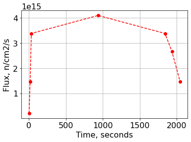

.. _xsinterface_example:

A scenario with pre-generated XS and traces
===========================================

Description
-----------

Example on how to execute a full depletion calculations using pre-generated cross sections and traces.

Load modules
------------

.. code:: 

    import numpy as np
    from pyIsoDep.functions.maindepletionsolver import MainDepletion
    from pyIsoDep.functions.generatedata import TransmutationData
    from pyIsoDep.functions.postprocessresults import Results
    from pyIsoDep.functions.read_csv import ReadCsv
    from pyIsoDep.functions.xsinterface import XsInterface

Data Generation Stage
~~~~~~~~~~~~~~~~~~~~~

.. code:: 

    FY_WGT = 0.0  # determines the fission yield wieghting
    VOL = 332097.8  # cm^3
    
    xsTable, fields = ReadCsv("./bootstrap.csv")
    xs0 = TransmutationData(libraryFlag=True, wgtFY=1.0)
    xs0.ReadData(ID=xsTable[:, 0], sig_f=xsTable[:, 3], sig_c=xsTable[:, 2],
                       sig_alpha=xsTable[:, 4], flagBarns=True)
    
    xsTable, fields = ReadCsv("./tempramp.csv")
    xs1 = TransmutationData(libraryFlag=True, wgtFY=1.0)
    xs1.ReadData(ID=xsTable[:, 0], sig_f=xsTable[:, 3], sig_c=xsTable[:, 2],
                      sig_alpha=xsTable[:, 4], flagBarns=True)

XS Interface Stage
------------------

Single Dependency: temperature
~~~~~~~~~~~~~~~~~~~~~~~~~~~~~~

**Comment**: the cross sections used here were not really generated for
multiple temperatures, but we will assume they are.

.. code:: 

    # Define the pre-generated sets for the different perturbations
    xs = XsInterface(numdepn=1, numpert=3, states=[[500], [600], [700]],
                     xssets=[xs0, xs1, xs1], extrpFlag=True)
    # Set-up the traces
    timepoints, xsTimeSets = xs.setTimeTrace([0.0, 5.5, 30.0], [525, 550, 575])

Two Dependencies: temperature and pressure
~~~~~~~~~~~~~~~~~~~~~~~~~~~~~~~~~~~~~~~~~~

.. code:: 

    xs = XsInterface(numdepn=2, numpert=6, states=[[500, 2], [500, 3], [500, 4],
                                                    [600, 2], [600, 3], [600, 4]],
                      xssets=[xs0, xs0, xs0, xs0, xs0, xs0], extrpFlag=True)
    
    timepoints, xsTimeSets = xs.setTimeTrace([0, 3.5], [500, 550], [3.0, 3.5])

Three dependencies: temperature, pressure, and xenon
~~~~~~~~~~~~~~~~~~~~~~~~~~~~~~~~~~~~~~~~~~~~~~~~~~~~

**Comment**: the cross sections used here were not really generated for
multiple temperatures, but we will assume they are.

.. code:: 

    xs = XsInterface(numdepn=3, numpert=18,
                     states=[[500, 2, 1E-05], [500, 2, 2E-05], [500, 2, 3E-05],
                             [500, 3, 1E-05], [500, 3, 2E-05], [500, 3, 3E-05],
                             [500, 5, 1E-05], [500, 5, 2E-05], [500, 5, 3E-05],
                             [600, 2, 1E-05], [600, 2, 2E-05], [600, 2, 3E-05],
                             [600, 3, 1E-05], [600, 3, 2E-05], [600, 3, 3E-05],
                             [600, 5, 1E-05], [600, 5, 2E-05], [600, 5, 3E-05]],
                     xssets=[xs0, xs0, xs0, xs0, xs0,
                             xs0, xs0, xs0, xs0, xs0,
                             xs0, xs0, xs0, xs0, xs0,
                             xs0, xs0, xs0], extrpFlag=True)
    # Set-up the traces
    timepoints, xsTimeSets =\
        xs.setTimeTrace([0.0, 50.0, 100.0], [525, 550, 575], [2.5, 3.5, 3.75], [1.5E-05, 2.5E-05, 2.75E-05])

Depletion Stage
~~~~~~~~~~~~~~~

Execute Depletion
^^^^^^^^^^^^^^^^^

.. code:: 

    dep = MainDepletion(timepoints, *xsTimeSets)
    # define metadata (steps, flux, and so on)
    power = 1E+6*np.array([16.545, 118.49, 272.52, 330.22, 272.52, 214.82, 118.49])
    dt = np.array([5.5, 24.5, 7., 1800., 7., 180., 40.])
    dep.SetDepScenario(power=power, timeUnits="seconds", timesteps=dt)
    # set initial composition
    dep.SetInitialComposition(xsTable[:, 0], xsTable[:, 1], vol=VOL)
    # solve the Bateman equations
    dep.SolveDepletion(method="cram", xsinterp=False)

Post depletion analysis
^^^^^^^^^^^^^^^^^^^^^^^

.. code:: 

    dep.DecayHeat()
    dep.Radiotoxicity()
    dep.Activity()
    dep.Mass()

Post-process results
~~~~~~~~~~~~~~~~~~~~

.. code:: 

    res = Results(dep)

.. code:: 

    res.getvalues("totalQt")

.. parsed-literal::

    array([2.26062673e-03, 2.31077846e+05, 2.92441792e+06, 5.53613244e+06,
           1.57902852e+07, 1.48928810e+07, 1.16482768e+07, 8.88484757e+06])

.. code:: 

    res.plot("Nt", timeUnits="seconds", markers=['--^', '--o'], isotopes=[531350, 922360],
             ylabel="Atomic density, #/b/cm")

.. code:: 

    res.plot("totalQt", timeUnits="seconds", norm=1E+6, ylabel="Decay heat, MW")

.. image:: xs_interface_files/xs_interface_27_0.png

.. code:: 

    res.plot("flux", timeUnits="seconds", markers="--ro", ylabel="Flux, n/cm2/s")

